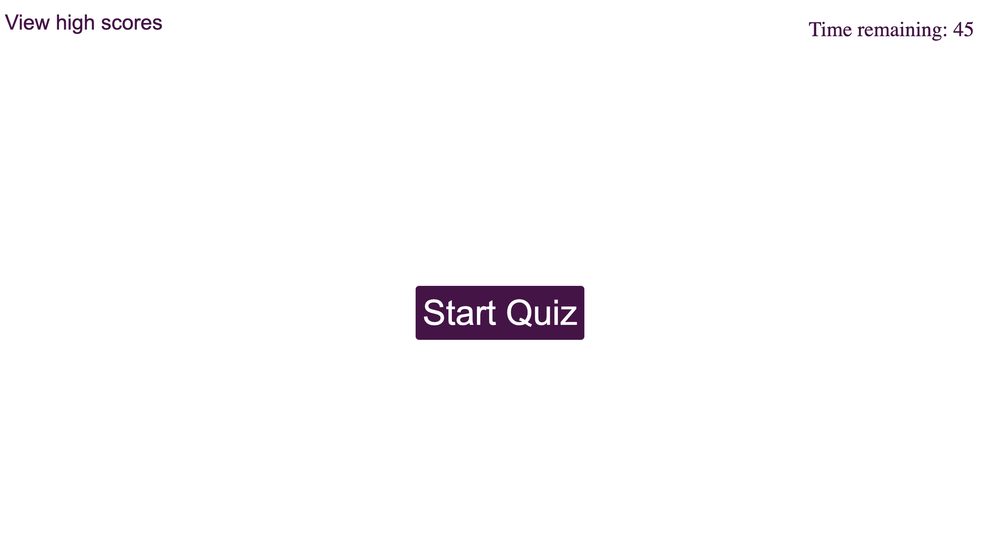

# code-quiz

## Description

The purpose of this project was to use JavaScript to create dynamic HTML elements to make a timed quiz testing a student's knowledge of web development. Students are then able to save their scores to a list of high scores using local storage.

[Link] (https://jboyce313.github.io/code-quiz/)
